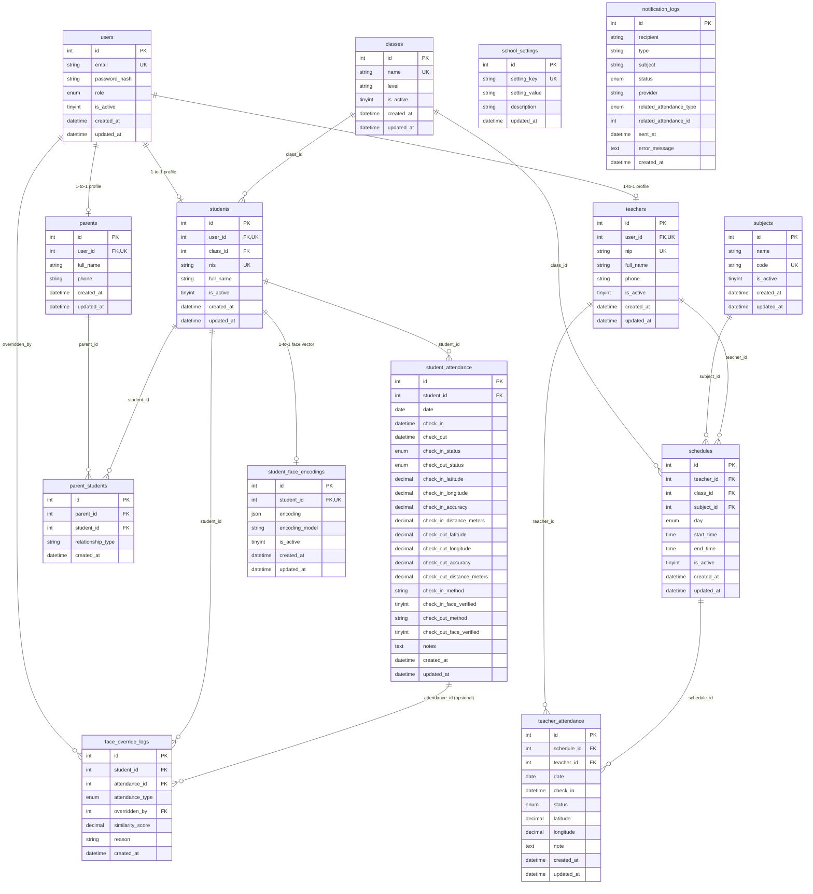

# Dokumentasi Struktur Database IDN Attendance System

Dokumen ini menjelaskan secara menyeluruh struktur database MySQL untuk sistem **IDN Boarding School Attendance API** yang didefinisikan pada file [`database/schema.sql`](file:///c:/xampp/htdocs/in-house-training-inovasia/IDN_Attendance_API/database/schema.sql).

---

## 1. Diagram Relasi Entitas (ERD)

---

## 2. Ringkasan & Karakteristik Arsitektur Database

1. **Pemisahan Identitas Auth (`users`) vs Profil Entitas (`teachers`, `students`, `parents`)**:
   - Autentikasi dan kredensial login (email, bcrypt password hash, role) terpusat di tabel `users`.
   - Data profil spesifik per role dipisah ke tabel masing-masing dan terhubung `1-to-1` via `user_id` (`UNIQUE KEY` + `FOREIGN KEY ON DELETE CASCADE`).
   - Role yang didukung: `'admin'`, `'teacher'`, `'student'`, `'parent'`.
2. **Relasi Many-to-Many Wali Santri & Siswa (`parent_students`)**:
   - Satu wali santri bisa memiliki beberapa anak di sekolah (kakak-beradik), dan satu siswa bisa dihubungkan ke lebih dari satu wali (misalnya ayah dan ibu).
   - Menyimpan `relationship_type` (ayah, ibu, wali).
3. **Pemisahan Model Absensi Siswa vs Guru**:
   - **`student_attendance` (Daily based)**: 1 siswa memiliki maksimal 1 baris absensi per hari kalender (`UNIQUE KEY (student_id, date)`), mencakup waktu `check_in` dan `check_out`, status (`present`, `late`, `sick`, `permission`, `absent`), validasi koordinat GPS (jarak Haversine), metode, serta status verifikasi wajah.
   - **`teacher_attendance` (Session/Schedule based)**: Terikat ke sesi mengajar per jadwal (`UNIQUE KEY (schedule_id, date)`). Guru hanya melakukan `check_in` pada setiap sesi jadwal yang diajarnya di hari tersebut.
4. **Dynamic Configuration via `school_settings`**:
   - Parameter operasional disimpan sebagai key-value di database sehingga admin dapat mengubah aturan (jam masuk, toleransi keterlambatan, titik koordinat & radius sekolah, toggle notifikasi, ambang batas wajah) tanpa perlu redeploy kode.
5. **Audit Logging & Biometrik**:
   - `notification_logs`: Mencatat setiap histori pengiriman email dan WhatsApp (sukses/gagal, provider, target penerima, pesan error).
   - `student_face_encodings`: Menyimpan vector embedding wajah (array float dalam format `JSON`) untuk pengenalan wajah.
   - `face_override_logs`: Mencatat audit trail jika verifikasi wajah gagal namun diloloskan secara manual oleh admin/guru beserta alasannya.

---

## 3. Detail Kamus Data (Data Dictionary)

### 3.1. Tabel `users`
Menyimpan identitas dasar dan kredensial login seluruh pengguna sistem.

| Kolom | Tipe Data | Nullable | Default | Keterangan & Constraint |
|---|---|---|---|---|
| `id` | `INT UNSIGNED` | NO | AUTO_INCREMENT | Primary Key |
| `email` | `VARCHAR(150)` | NO | - | Unique Key (`uq_users_email`), email login |
| `password_hash` | `VARCHAR(255)` | NO | - | Hash password menggunakan bcrypt (cost 10) |
| `role` | `ENUM('admin','teacher','student','parent')` | NO | - | Role akun; terindeks (`idx_users_role`) |
| `is_active` | `TINYINT(1)` | NO | `1` | `1` = aktif, `0` = nonaktif / ditangguhkan |
| `created_at` | `DATETIME` | NO | `CURRENT_TIMESTAMP` | Waktu akun dibuat |
| `updated_at` | `DATETIME` | NO | `CURRENT_TIMESTAMP ON UPDATE CURRENT_TIMESTAMP` | Waktu data terakhir diubah |

---

### 3.2. Tabel `classes`
Master data rombongan belajar / kelas.

| Kolom | Tipe Data | Nullable | Default | Keterangan & Constraint |
|---|---|---|---|---|
| `id` | `INT UNSIGNED` | NO | AUTO_INCREMENT | Primary Key |
| `name` | `VARCHAR(50)` | NO | - | Unique Key (`uq_classes_name`), contoh: 'X RPL A', 'XI TKJ B' |
| `level` | `VARCHAR(20)` | YES | `NULL` | Tingkat kelas, contoh: 'X', 'XI', 'XII' |
| `is_active` | `TINYINT(1)` | NO | `1` | `1` = kelas aktif, `0` = nonaktif |
| `created_at` | `DATETIME` | NO | `CURRENT_TIMESTAMP` | Waktu dibuat |
| `updated_at` | `DATETIME` | NO | `CURRENT_TIMESTAMP ON UPDATE CURRENT_TIMESTAMP` | Waktu terakhir diubah |

---

### 3.3. Tabel `subjects`
Master data mata pelajaran.

| Kolom | Tipe Data | Nullable | Default | Keterangan & Constraint |
|---|---|---|---|---|
| `id` | `INT UNSIGNED` | NO | AUTO_INCREMENT | Primary Key |
| `name` | `VARCHAR(100)` | NO | - | Nama mata pelajaran, contoh: 'Pemrograman Web' |
| `code` | `VARCHAR(20)` | YES | `NULL` | Unique Key (`uq_subjects_code`), kode mapel, contoh: 'PW-01' |
| `is_active` | `TINYINT(1)` | NO | `1` | `1` = mapel aktif, `0` = nonaktif |
| `created_at` | `DATETIME` | NO | `CURRENT_TIMESTAMP` | Waktu dibuat |
| `updated_at` | `DATETIME` | NO | `CURRENT_TIMESTAMP ON UPDATE CURRENT_TIMESTAMP` | Waktu terakhir diubah |

---

### 3.4. Tabel `teachers`
Data profil guru/pengajar. Terhubung 1-to-1 dengan tabel `users`.

| Kolom | Tipe Data | Nullable | Default | Keterangan & Constraint |
|---|---|---|---|---|
| `id` | `INT UNSIGNED` | NO | AUTO_INCREMENT | Primary Key |
| `user_id` | `INT UNSIGNED` | NO | - | Unique Key (`uq_teachers_user_id`), FK ke `users.id` (ON DELETE CASCADE) |
| `nip` | `VARCHAR(30)` | YES | `NULL` | Unique Key (`uq_teachers_nip`), Nomor Induk Pegawai |
| `full_name` | `VARCHAR(150)` | NO | - | Nama lengkap guru beserta gelar |
| `phone` | `VARCHAR(20)` | YES | `NULL` | Nomor telepon/WhatsApp guru |
| `is_active` | `TINYINT(1)` | NO | `1` | `1` = aktif mengajar, `0` = nonaktif |
| `created_at` | `DATETIME` | NO | `CURRENT_TIMESTAMP` | Waktu dibuat |
| `updated_at` | `DATETIME` | NO | `CURRENT_TIMESTAMP ON UPDATE CURRENT_TIMESTAMP` | Waktu terakhir diubah |

---

### 3.5. Tabel `students`
Data profil santri/siswa. Terhubung 1-to-1 dengan tabel `users` dan belongs to `classes`.

| Kolom | Tipe Data | Nullable | Default | Keterangan & Constraint |
|---|---|---|---|---|
| `id` | `INT UNSIGNED` | NO | AUTO_INCREMENT | Primary Key |
| `user_id` | `INT UNSIGNED` | NO | - | Unique Key (`uq_students_user_id`), FK ke `users.id` (ON DELETE CASCADE) |
| `class_id` | `INT UNSIGNED` | YES | `NULL` | FK ke `classes.id` (ON DELETE SET NULL), kelas siswa |
| `nis` | `VARCHAR(30)` | NO | - | Unique Key (`uq_students_nis`), Nomor Induk Siswa |
| `full_name` | `VARCHAR(150)` | NO | - | Nama lengkap santri |
| `is_active` | `TINYINT(1)` | NO | `1` | `1` = siswa aktif, `0` = nonaktif / alumni / keluar |
| `created_at` | `DATETIME` | NO | `CURRENT_TIMESTAMP` | Waktu dibuat |
| `updated_at` | `DATETIME` | NO | `CURRENT_TIMESTAMP ON UPDATE CURRENT_TIMESTAMP` | Waktu terakhir diubah |

---

### 3.6. Tabel `parents`
Data profil wali santri. Terhubung 1-to-1 dengan tabel `users`.

| Kolom | Tipe Data | Nullable | Default | Keterangan & Constraint |
|---|---|---|---|---|
| `id` | `INT UNSIGNED` | NO | AUTO_INCREMENT | Primary Key |
| `user_id` | `INT UNSIGNED` | NO | - | Unique Key (`uq_parents_user_id`), FK ke `users.id` (ON DELETE CASCADE) |
| `full_name` | `VARCHAR(150)` | NO | - | Nama lengkap orang tua / wali |
| `phone` | `VARCHAR(20)` | YES | `NULL` | Nomor telepon/WhatsApp wali (untuk notifikasi WA Fonnte) |
| `created_at` | `DATETIME` | NO | `CURRENT_TIMESTAMP` | Waktu dibuat |
| `updated_at` | `DATETIME` | NO | `CURRENT_TIMESTAMP ON UPDATE CURRENT_TIMESTAMP` | Waktu terakhir diubah |

---

### 3.7. Tabel `parent_students`
Tabel pivot relasi many-to-many antara wali santri (`parents`) dan siswa (`students`).

| Kolom | Tipe Data | Nullable | Default | Keterangan & Constraint |
|---|---|---|---|---|
| `id` | `INT UNSIGNED` | NO | AUTO_INCREMENT | Primary Key |
| `parent_id` | `INT UNSIGNED` | NO | - | FK ke `parents.id` (ON DELETE CASCADE) |
| `student_id` | `INT UNSIGNED` | NO | - | FK ke `students.id` (ON DELETE CASCADE) |
| `relationship_type` | `VARCHAR(30)` | YES | `NULL` | Hubungan kekeluargaan ('ayah', 'ibu', 'wali') |
| `created_at` | `DATETIME` | NO | `CURRENT_TIMESTAMP` | Waktu relasi dibuat |

> **Constraint Khusus:** `UNIQUE KEY (parent_id, student_id)` mencegah duplikasi relasi yang sama.

---

### 3.8. Tabel `schedules`
Jadwal kegiatan belajar mengajar (KBM) guru per kelas, mapel, hari, dan jam.

| Kolom | Tipe Data | Nullable | Default | Keterangan & Constraint |
|---|---|---|---|---|
| `id` | `INT UNSIGNED` | NO | AUTO_INCREMENT | Primary Key |
| `teacher_id` | `INT UNSIGNED` | NO | - | FK ke `teachers.id` (ON DELETE CASCADE) |
| `class_id` | `INT UNSIGNED` | NO | - | FK ke `classes.id` (ON DELETE CASCADE) |
| `subject_id` | `INT UNSIGNED` | NO | - | FK ke `subjects.id` (ON DELETE CASCADE) |
| `day` | `ENUM('monday','tuesday','wednesday','thursday','friday','saturday','sunday')` | NO | - | Hari mengajar (lowercase) |
| `start_time` | `TIME` | NO | - | Jam mulai sesi mengajar (format HH:mm:ss) |
| `end_time` | `TIME` | NO | - | Jam selesai sesi mengajar (format HH:mm:ss) |
| `is_active` | `TINYINT(1)` | NO | `1` | `1` = jadwal aktif, `0` = nonaktif |
| `created_at` | `DATETIME` | NO | `CURRENT_TIMESTAMP` | Waktu dibuat |
| `updated_at` | `DATETIME` | NO | `CURRENT_TIMESTAMP ON UPDATE CURRENT_TIMESTAMP` | Waktu terakhir diubah |

---

### 3.9. Tabel `student_attendance`
Catatan absensi harian siswa (masuk & pulang).

| Kolom | Tipe Data | Nullable | Default | Keterangan & Constraint |
|---|---|---|---|---|
| `id` | `INT UNSIGNED` | NO | AUTO_INCREMENT | Primary Key |
| `student_id` | `INT UNSIGNED` | NO | - | FK ke `students.id` (ON DELETE CASCADE) |
| `date` | `DATE` | NO | - | Tanggal absensi (YYYY-MM-DD) |
| `check_in` | `DATETIME` | YES | `NULL` | Waktu check-in siswa |
| `check_out` | `DATETIME` | YES | `NULL` | Waktu check-out siswa |
| `check_in_status` | `ENUM('present','late','sick','permission','absent')` | YES | `NULL` | Status kehadiran saat check-in |
| `check_out_status` | `ENUM('present','late','sick','permission','absent')` | YES | `NULL` | Status kehadiran saat check-out |
| `check_in_latitude` | `DECIMAL(10,7)` | YES | `NULL` | Koordinat latitude saat check-in |
| `check_in_longitude` | `DECIMAL(10,7)` | YES | `NULL` | Koordinat longitude saat check-in |
| `check_in_accuracy` | `DECIMAL(8,2)` | YES | `NULL` | Akurasi GPS (meter) |
| `check_in_distance_meters` | `DECIMAL(8,2)` | YES | `NULL` | Jarak dari sekolah hasil rumus Haversine |
| `check_out_latitude` | `DECIMAL(10,7)` | YES | `NULL` | Koordinat latitude saat check-out |
| `check_out_longitude` | `DECIMAL(10,7)` | YES | `NULL` | Koordinat longitude saat check-out |
| `check_out_accuracy` | `DECIMAL(8,2)` | YES | `NULL` | Akurasi GPS (meter) |
| `check_out_distance_meters` | `DECIMAL(8,2)` | YES | `NULL` | Jarak dari sekolah hasil rumus Haversine |
| `check_in_method` | `VARCHAR(30)` | YES | `NULL` | Metode check-in ('manual', 'face', 'qr', dll) |
| `check_in_face_verified` | `TINYINT(1)` | YES | `NULL` | `NULL` = tidak diverifikasi, `1` = cocok, `0` = override |
| `check_out_method` | `VARCHAR(30)` | YES | `NULL` | Metode check-out |
| `check_out_face_verified` | `TINYINT(1)` | YES | `NULL` | `NULL` = tidak diverifikasi, `1` = cocok, `0` = override |
| `notes` | `TEXT` | YES | `NULL` | Catatan tambahan |
| `created_at` | `DATETIME` | NO | `CURRENT_TIMESTAMP` | Waktu record dibuat |
| `updated_at` | `DATETIME` | NO | `CURRENT_TIMESTAMP ON UPDATE CURRENT_TIMESTAMP` | Waktu record diubah |

> **Constraint Khusus:** `UNIQUE KEY (student_id, date)` memastikan 1 siswa hanya memiliki 1 baris absensi per hari (anti double check-in).

---

### 3.10. Tabel `teacher_attendance`
Catatan absensi guru per sesi jadwal KBM yang diajar.

| Kolom | Tipe Data | Nullable | Default | Keterangan & Constraint |
|---|---|---|---|---|
| `id` | `INT UNSIGNED` | NO | AUTO_INCREMENT | Primary Key |
| `schedule_id` | `INT UNSIGNED` | NO | - | FK ke `schedules.id` (ON DELETE CASCADE) |
| `teacher_id` | `INT UNSIGNED` | NO | - | FK ke `teachers.id` (ON DELETE CASCADE) |
| `date` | `DATE` | NO | - | Tanggal sesi mengajar (YYYY-MM-DD) |
| `check_in` | `DATETIME` | YES | `NULL` | Waktu guru check-in pada sesi tersebut |
| `status` | `ENUM('present','late','absent')` | YES | `NULL` | Status kehadiran guru |
| `latitude` | `DECIMAL(10,7)` | YES | `NULL` | Koordinat latitude saat check-in |
| `longitude` | `DECIMAL(10,7)` | YES | `NULL` | Koordinat longitude saat check-in |
| `note` | `TEXT` | YES | `NULL` | Catatan materi atau kendala kelas |
| `created_at` | `DATETIME` | NO | `CURRENT_TIMESTAMP` | Waktu dibuat |
| `updated_at` | `DATETIME` | NO | `CURRENT_TIMESTAMP ON UPDATE CURRENT_TIMESTAMP` | Waktu terakhir diubah |

> **Constraint Khusus:** `UNIQUE KEY (schedule_id, date)` memastikan 1 jadwal hanya bisa diabsen 1 kali per hari.

---

### 3.11. Tabel `school_settings`
Konfigurasi dinamis sistem berbasis pasangan key-value.

| Kolom | Tipe Data | Nullable | Default | Keterangan & Constraint |
|---|---|---|---|---|
| `id` | `INT UNSIGNED` | NO | AUTO_INCREMENT | Primary Key |
| `setting_key` | `VARCHAR(100)` | NO | - | Unique Key (`uq_school_settings_key`), nama konfigurasi |
| `setting_value` | `VARCHAR(255)` | NO | - | Nilai konfigurasi |
| `description` | `VARCHAR(255)` | YES | `NULL` | Keterangan fungsi konfigurasi |
| `updated_at` | `DATETIME` | NO | `CURRENT_TIMESTAMP ON UPDATE CURRENT_TIMESTAMP` | Waktu terakhir diupdate |

#### Daftar Konfigurasi Default Sistem:
- `school_start_time`: Batas jam masuk sekolah (default `'07:00:00'`). Setelah jam ini status check-in siswa otomatis `'late'`.
- `gps_validation_enabled`: Toggle validasi radius GPS (`'true'` / `'false'`).
- `school_latitude` & `school_longitude`: Titik koordinat acuan lokasi sekolah.
- `school_radius_meters`: Radius toleransi absensi siswa (default `'200'` meter).
- `notify_parent_on_check_in`: Toggle kirim notifikasi saat siswa check-in (`'true'` / `'false'`).
- `notify_parent_on_check_out`: Toggle kirim notifikasi saat siswa check-out (`'true'` / `'false'`).
- `notify_parent_on_late`: Toggle kirim notifikasi khusus saat siswa terlambat (`'true'` / `'false'`).
- `notify_parent_on_absent`: Toggle kirim notifikasi saat siswa tidak hadir (`'true'` / `'false'`).
- `teacher_late_tolerance_minutes`: Toleransi keterlambatan guru dari `start_time` jadwal dalam menit (default `'10'`).
- `face_verification_enabled`: Toggle validasi biometrik wajah siswa (`'true'` / `'false'`).
- `face_match_threshold`: Ambang batas skor kemiripan wajah / Cosine Similarity (default `'0.6'`).

---

### 3.12. Tabel `notification_logs`
Audit trail pengiriman notifikasi multi-channel (Email SMTP / WhatsApp Fonnte).

| Kolom | Tipe Data | Nullable | Default | Keterangan & Constraint |
|---|---|---|---|---|
| `id` | `INT UNSIGNED` | NO | AUTO_INCREMENT | Primary Key |
| `recipient` | `VARCHAR(150)` | NO | - | Alamat email atau nomor WhatsApp tujuan |
| `type` | `VARCHAR(50)` | NO | - | Tipe event (`STUDENT_CHECK_IN`, `STUDENT_CHECK_OUT`, `STUDENT_LATE`, `STUDENT_ABSENT`) |
| `subject` | `VARCHAR(255)` | YES | `NULL` | Subjek email atau judul pesan |
| `status` | `ENUM('success','failed')` | NO | - | Status pengiriman |
| `provider` | `VARCHAR(50)` | YES | `NULL` | Nama provider (`nodemailer-smtp`, `fonnte-whatsapp`, dll) |
| `related_attendance_type` | `ENUM('student','teacher')` | YES | `NULL` | Konteks absensi terkait |
| `related_attendance_id` | `INT UNSIGNED` | YES | `NULL` | ID absensi yang memicu notifikasi |
| `sent_at` | `DATETIME` | YES | `NULL` | Waktu notifikasi terkirim |
| `error_message` | `TEXT` | YES | `NULL` | Pesan error jika pengiriman gagal |
| `created_at` | `DATETIME` | NO | `CURRENT_TIMESTAMP` | Waktu log dibuat |

---

### 3.13. Tabel `student_face_encodings`
Menyimpan vector embedding wajah santri untuk autentikasi biometrik.

| Kolom | Tipe Data | Nullable | Default | Keterangan & Constraint |
|---|---|---|---|---|
| `id` | `INT UNSIGNED` | NO | AUTO_INCREMENT | Primary Key |
| `student_id` | `INT UNSIGNED` | NO | - | Unique Key (`uq_student_face_encodings_student`), FK ke `students.id` (ON DELETE CASCADE) |
| `encoding` | `JSON` | NO | - | Array of float (vector 128/512 dimensi) hasil ekstraksi model wajah |
| `encoding_model` | `VARCHAR(50)` | YES | `NULL` | Nama/versi model yang digunakan (misal `face-api-v1`) |
| `is_active` | `TINYINT(1)` | NO | `1` | `1` = template aktif digunakan |
| `created_at` | `DATETIME` | NO | `CURRENT_TIMESTAMP` | Waktu enrollment |
| `updated_at` | `DATETIME` | NO | `CURRENT_TIMESTAMP ON UPDATE CURRENT_TIMESTAMP` | Waktu enrollment diperbarui |

---

### 3.14. Tabel `face_override_logs`
Audit log saat verifikasi biometrik wajah siswa gagal/bermasalah dan diloloskan secara manual oleh pihak yang berwenang (Admin atau Guru).

| Kolom | Tipe Data | Nullable | Default | Keterangan & Constraint |
|---|---|---|---|---|
| `id` | `INT UNSIGNED` | NO | AUTO_INCREMENT | Primary Key |
| `student_id` | `INT UNSIGNED` | NO | - | FK ke `students.id` (ON DELETE CASCADE) |
| `attendance_id` | `INT UNSIGNED` | YES | `NULL` | ID baris pada `student_attendance` (jika sudah terbentuk) |
| `attendance_type` | `ENUM('check_in','check_out')` | NO | - | Jenis absensi yang di-override |
| `overridden_by` | `INT UNSIGNED` | NO | - | FK ke `users.id` akun admin/guru yang melakukan override (ON DELETE RESTRICT) |
| `similarity_score` | `DECIMAL(5,4)` | YES | `NULL` | Skor kemiripan saat gagal (0.0000 - 1.0000) |
| `reason` | `VARCHAR(255)` | NO | - | Alasan wajib dari petugas (mis. kamera rusak, pencahayaan minim) |
| `created_at` | `DATETIME` | NO | `CURRENT_TIMESTAMP` | Waktu override dilakukan |

---

## 4. Integritas Relasi & Aturan Penghapusan Data (Foreign Keys)

1. **`ON DELETE CASCADE`**:
   - Jika akun `users` dihapus, maka profil di `teachers`, `students`, atau `parents` otomatis terhapus.
   - Jika data `students` dihapus, seluruh data riwayat `student_attendance`, `parent_students`, `student_face_encodings`, dan `face_override_logs` miliknya otomatis terhapus.
   - Jika data `parents` dihapus, relasi di `parent_students` otomatis terhapus.
   - Jika data `teachers`, `classes`, atau `subjects` dihapus, jadwal di `schedules` dan `teacher_attendance` terkait otomatis terhapus (namun pada application level, penghapusan dicegah jika masih memiliki relasi aktif).
2. **`ON DELETE SET NULL`**:
   - Jika suatu `classes` dihapus, kolom `students.class_id` diubah menjadi `NULL` sehingga data profil siswa tidak hilang.
3. **`ON DELETE RESTRICT`**:
   - Penghapusan akun pengguna di `users` akan ditolak jika `user_id` tersebut tercatat sebagai aktor pelaksana pada audit `face_override_logs.overridden_by`.
