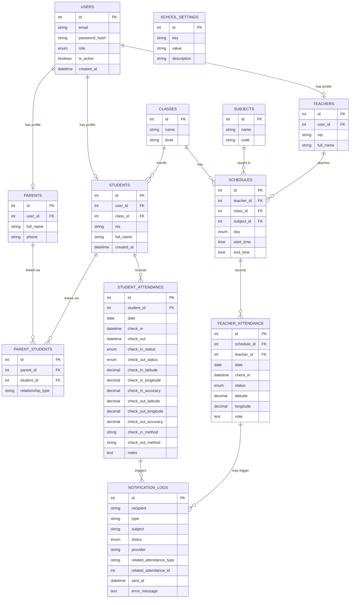

# IDN Boarding School — Attendance API
## PHASE 1 — Analisis & Arsitektur

---

## 1. Analisis Requirement (Ringkasan)

Sistem yang akan dibangun adalah **REST API absensi** untuk boarding school, dikonsumsi oleh dua client (React Web, React + Capacitor), dengan backend Node.js/Express/MySQL, deploy ke Vercel (API) + Railway (MySQL).

Karakteristik penting yang memengaruhi desain:

- **Dua jenis absensi berbeda konteks**: absensi siswa (datang/pulang, berbasis hari) dan absensi guru (per sesi mengajar, berbasis jadwal). Ini bukan satu tabel yang sama — polanya beda total, jadi harus dipisah sejak awal.
- **Boarding school** → siswa tinggal di asrama. Ini penting untuk desain absen guru vs siswa: kemungkinan besar tetap ada jadwal kelas formal (KBM), jadi asumsi "absen masuk = ke sekolah, bukan ke asrama" saya pakai sebagai default MVP. Saya tandai ini sebagai asumsi, bukan fakta — akan saya konfirmasi ulang kalau kamu punya konteks tambahan (misalnya apakah ada absen sholat/asrama yang perlu masuk scope).
- **Multi-role, multi-anak**: satu parent bisa punya banyak anak → butuh tabel relasi many-to-many, bukan foreign key langsung di `students`.
- **Konfigurasi harus fleksibel**: jam masuk sekolah, radius GPS, rule notifikasi — semua harus bisa diubah tanpa redeploy code (disimpan di DB, bukan hardcode).
- **Constraint kritis untuk integritas data**: no double check-in/check-out per hari, no double teacher-attendance per schedule per hari. Ini harus dijaga di level database (UNIQUE constraint), bukan cuma validasi di application layer — supaya aman dari race condition.
- **Free-tier reality check**: Vercel Serverless Functions itu *stateless* dan *cold-start* — koneksi MySQL harus dikelola hati-hati (connection pooling per-invocation, bukan pool besar seperti di server tradisional). Ini akan saya bahas detail di Phase 5–6, tapi sudah masuk pertimbangan arsitektur sejak sekarang.

---

## 2. Daftar Aktor & Role

| Role | Deskripsi | Akses Utama |
|---|---|---|
| **admin** | Staff TU / operator sistem | Kelola master data (siswa, guru, kelas, mapel, jadwal), lihat semua rekap, kelola konfigurasi sekolah |
| **teacher** | Guru pengajar | Lihat jadwal mengajar sendiri, absen mengajar, lihat rekap absensi kelas yang diajar |
| **student** | Siswa | Absen masuk/pulang, lihat riwayat absensi sendiri |
| **parent** | Wali santri | Lihat absensi anak (bisa lebih dari satu anak), terima notifikasi |

Catatan desain: `users` adalah tabel identitas+auth (email, password_hash, role), sedangkan `students`/`teachers`/`parents` adalah tabel profil yang terhubung 1-to-1 ke `users`. Ini supaya auth logic tetap satu tempat, terlepas dari role.

---

## 3. Use Case Utama

1. **UC1 — Login**: User (semua role) login dengan email+password → dapat JWT.
2. **UC2 — Siswa absen masuk**: Siswa check-in → sistem tentukan status (present/late) berdasarkan `school_settings` → simpan → trigger notifikasi ke parent.
3. **UC3 — Siswa absen pulang**: Siswa check-out → validasi belum pernah check-out hari itu → simpan → trigger notifikasi.
4. **UC4 — Guru absen mengajar**: Guru pilih `schedule_id` → sistem ambil kelas/mapel/jam dari schedule → validasi guru = pemilik schedule (dari JWT, bukan input) → simpan.
5. **UC5 — Admin kelola master data**: CRUD students, teachers, classes, subjects, schedules.
6. **UC6 — Parent lihat absensi anak**: Parent lihat daftar anak → pilih anak → lihat riwayat absensi.
7. **UC7 — Sistem kirim notifikasi otomatis**: Setiap event absensi (check-in/check-out/late/absent) → cek `school_settings` rule → kirim email → catat di `notification_logs`.
8. **UC8 — Admin/Teacher lihat rekap**: Filter by tanggal/kelas/siswa/guru → hasil agregat kehadiran.
9. **UC9 (fase lanjut) — Absen via QR**: Guru/admin tampilkan QR dinamis → siswa scan → submit ke API → validasi token+waktu+siswa.
10. **UC10 (fase lanjut) — Validasi GPS**: Saat check-in/out, backend cek radius dari titik sekolah (bisa on/off via config).

---

## 4. Arsitektur Backend

```
┌─────────────────┐     ┌──────────────────────┐
│   React Web      │     │  React + Capacitor    │
│  (browser)        │     │  (Android/iOS)         │
└────────┬─────────┘     └──────────┬────────────┘
         │                          │
         └───────────┬──────────────┘
                      │  HTTPS (REST + JWT)
                      ▼
         ┌────────────────────────────┐
         │   Vercel (Serverless)       │
         │   Express.js API             │
         │                              │
         │  Routes → Middleware →       │
         │  Controller → Service →      │
         │  (Repository) → DB Layer     │
         └──────────────┬───────────────┘
                         │  MySQL protocol (SSL)
                         ▼
         ┌────────────────────────────┐
         │   Railway — MySQL 8          │
         └────────────────────────────┘
                         │
                         ▼
         ┌────────────────────────────┐
         │  Notification Service        │
         │  (abstraction layer)         │
         └──────────────┬───────────────┘
                         │
                         ▼
              Email Provider (SMTP/API)
                         │
                         ▼
                    Wali Santri
```

**Layer responsibility (dari Phase 21, saya konkretkan di sini):**

- **Routes** — hanya mapping URL → controller, tidak ada logic.
- **Middleware** — `auth.middleware.js` (verifikasi JWT), `role.middleware.js` (cek role), `validate.middleware.js` (jalankan validator Zod/express-validator), `error.middleware.js` (centralized error handler).
- **Controller** — terima request, panggil service, bentuk response. Tidak ada query SQL atau business rule di sini.
- **Service** — business logic murni: "apakah siswa ini terlambat?", "apakah guru ini boleh absen schedule ini?", "kirim notifikasi atau tidak?".
- **Repository/DB layer** — untuk MVP saya rekomendasikan **query builder ringan** (native `mysql2` dengan prepared statements, dibungkus fungsi-fungsi per tabel) daripada full repository pattern/ORM berat. Alasan: ORM (misal Sequelize/Prisma) menambah kompleksitas setup + cold-start time di Vercel serverless, sementara `mysql2` + connection pool ringan sudah cukup untuk skala sekolah. Ini akan saya jelaskan trade-off-nya lebih detail di Phase 5, tapi keputusan ini saya ambil sekarang supaya arsitektur konsisten dari awal.

---

## 5. Arsitektur Database (Level Konsep)

Prinsip desain:

- `users` = identitas + kredensial (single source of truth untuk auth).
- Tabel profil (`students`, `teachers`, `parents`) terpisah dari `users`, terhubung via `user_id`.
- Relasi parent–student **many-to-many** lewat tabel penghubung (`parent_students`), karena satu parent bisa punya banyak anak, dan (secara teori) satu anak bisa dikaitkan lebih dari satu wali (ayah & ibu keduanya terdaftar).
- Absensi siswa = **1 baris per siswa per hari** (check_in & check_out di kolom yang sama), sesuai instruksi kamu di poin 14.
- Absensi guru = **1 baris per schedule per hari** (bukan per guru per hari), karena satu guru bisa punya beberapa jadwal mengajar dalam sehari.
- Semua konfigurasi yang bisa berubah (jam masuk, radius GPS, on/off notifikasi) → `school_settings`, bukan hardcode.

---

## 6. ERD (Mermaid)



*(Diagram final akan disesuaikan lagi di Phase 3/4 saat kita finalisasi tipe kolom persis.)*

---

## 7. Daftar Tabel (MVP)

| Tabel | Fungsi |
|---|---|
| `users` | Identitas & auth semua role |
| `students` | Profil siswa |
| `teachers` | Profil guru |
| `parents` | Profil wali santri |
| `parent_students` | Relasi many-to-many parent ↔ siswa |
| `classes` | Master data kelas |
| `subjects` | Master data mata pelajaran |
| `schedules` | Jadwal mengajar (guru+kelas+mapel+waktu) |
| `student_attendance` | Absensi siswa (1 baris/siswa/hari) |
| `teacher_attendance` | Absensi guru (1 baris/schedule/hari) |
| `school_settings` | Konfigurasi sistem (jam masuk, radius, rule notifikasi) |
| `notification_logs` | Log pengiriman notifikasi |

Tidak saya tambahkan tabel di luar ini untuk MVP — sesuai instruksi poin 11, saya hindari tabel tanpa fungsi jelas. Kandidat tabel tambahan (misal `qr_tokens` untuk fitur QR dinamis, `school_locations` untuk multi-titik GPS) akan saya ajukan nanti di Phase 13–14 saat fitur itu digarap, bukan sekarang.

---

## 8. Daftar Endpoint (Ringkas — detail request/response menyusul per phase)

```
AUTH
  POST   /api/auth/login
  GET    /api/auth/me

STUDENTS
  GET    /api/students
  GET    /api/students/:id
  GET    /api/students/:id/attendance

CLASSES
  GET    /api/classes
  GET    /api/classes/:id/students

SCHEDULES
  GET    /api/schedules/today
  GET    /api/teacher-schedules/today

STUDENT ATTENDANCE
  POST   /api/student-attendance/check-in
  POST   /api/student-attendance/check-out
  GET    /api/student-attendance/today
  GET    /api/student-attendance/history
  GET    /api/student-attendance/recap

TEACHER ATTENDANCE
  POST   /api/teacher-attendance/check-in
  GET    /api/teacher-attendance/today
  GET    /api/teacher-attendance/history
  GET    /api/teacher-attendance/recap

PARENT
  GET    /api/parents/me
  GET    /api/parents/children
  GET    /api/parents/children/:studentId/attendance

REPORTS
  GET    /api/reports/student-attendance
  GET    /api/reports/class-attendance
  GET    /api/reports/teacher-attendance
```

---

## 9. Alur Absensi Siswa Masuk

```
Siswa buka app → tap "Absen Masuk"
   │
   ▼
Frontend kirim POST /api/student-attendance/check-in
   (student_id dari JWT, bukan dari body — lihat catatan keamanan)
   │
   ▼
Backend:
  1. Validasi JWT + role = student
  2. Cek apakah sudah ada record hari ini → jika sudah check-in, tolak (409)
  3. Ambil jam masuk sekolah dari school_settings
  4. Bandingkan waktu sekarang vs jam masuk → tentukan status (present/late)
  5. (opsional, jika GPS aktif) Validasi radius lokasi
  6. INSERT student_attendance
  7. Panggil NotificationService → kirim email ke parent (async, tidak blocking response)
  8. Return response sukses
```

**Catatan keamanan penting**: meski instruksi awal menyebut `student_id` sebagai bagian dari data yang dikirim, untuk endpoint check-in/check-out saya rekomendasikan **backend mengambil `student_id` dari JWT** (bukan dari body request), supaya siswa A tidak bisa absen atas nama siswa B. `student_id` di body hanya relevan untuk endpoint yang diakses admin/teacher (misal input manual). Saya akan detailkan ini di Phase 9.

---

## 10. Alur Absensi Siswa Pulang

```
Siswa tap "Absen Pulang"
   │
   ▼
POST /api/student-attendance/check-out
   │
   ▼
Backend:
  1. Validasi JWT + role = student
  2. Cek record hari ini ADA (harus sudah check-in dulu — kebijakan ini bisa didiskusikan)
  3. Cek check_out belum diisi → jika sudah, tolak (409 "sudah absen pulang")
  4. (opsional) Validasi GPS
  5. UPDATE student_attendance SET check_out, check_out_status, dst.
  6. Trigger notifikasi
  7. Return response sukses
```

Pertanyaan desain yang perlu diputuskan di Phase 9: apakah siswa **wajib** check-in dulu sebelum bisa check-out? Saya asumsikan **ya** untuk MVP (lebih konsisten secara data), tapi ini bisa didiskusikan.

---

## 11. Alur Absensi Guru Mengajar

```
Guru buka jadwal hari ini → pilih sesi → tap "Absen Mengajar"
   │
   ▼
Frontend kirim POST /api/teacher-attendance/check-in
   Body: { schedule_id }
   (teacher_id TIDAK dikirim dari frontend — diambil dari JWT)
   │
   ▼
Backend:
  1. Validasi JWT + role = teacher
  2. Ambil schedule by schedule_id → dapat teacher_id, class_id, subject_id, start_time, end_time
  3. Validasi schedule.teacher_id === req.user.teacher_id (guru tidak bisa absen jadwal orang lain)
  4. Cek belum ada teacher_attendance untuk schedule_id + tanggal ini → jika sudah, tolak (409)
  5. Tentukan status (present/late) berdasarkan start_time vs waktu check-in
  6. INSERT teacher_attendance
  7. Return response sukses (data lengkap: nama guru, kelas, mapel, jam)
```

---

## 12. Alur Notifikasi Wali Santri

```
Event: student_attendance INSERT/UPDATE (check-in / check-out)
   │
   ▼
Attendance Service selesai simpan data
   │
   ▼
Panggil NotificationService.notify(eventType, attendanceData)
   │
   ▼
NotificationService:
  1. Cek school_settings → apakah notify_parent_on_<event> = true?
  2. Jika false → skip, tidak ada log
  3. Jika true:
     a. Cari parent(s) dari student_id via parent_students
     b. Susun pesan sesuai template (check-in/check-out/late/absent)
     c. Panggil Email Provider (via abstraction — provider bisa diganti)
     d. Catat hasil ke notification_logs (success/failed + error_message jika gagal)
   │
   ▼
Response ke frontend TIDAK menunggu hasil pengiriman email
(email dikirim best-effort, tidak boleh membuat request absensi jadi lambat/gagal
 hanya karena email provider down)
```

Ini poin desain penting: **kegagalan email tidak boleh menggagalkan absensi**. Absensi harus tetap tersimpan meski notifikasi gagal terkirim — makanya `notification_logs` penting, supaya admin bisa audit dan retry manual kalau perlu.

---

## 13. Rekomendasi Tool Gratis/Free Tier (Ringkasan Awal)

Saya beri ringkasan dulu di sini; detail lengkap (limit pasti, butuh kartu kredit atau tidak, cara dapat API key) akan saya bahas mendalam di Phase 12 (Notification) karena datanya bisa berubah dan saya perlu verifikasi.

| Kebutuhan | Kandidat | Catatan awal |
|---|---|---|
| Backend hosting | Vercel (Hobby/free) | Serverless function, ada limit durasi eksekusi & cold start — perlu desain koneksi DB yang hati-hati |
| Database | Railway (free/trial) | Railway sudah tidak selalu punya free tier permanen untuk semua service — **wajib dicek saat deployment**, saya tidak akan mengklaim tanpa verifikasi di Phase 4 |
| Email | Kandidat: Brevo, Resend, Gmail SMTP | Masing-masing punya limit harian berbeda — akan saya bandingkan detail di Phase 12, termasuk mana yang butuh domain verifikasi |
| QR Code | Library open-source (Node: `qrcode`, Frontend: `qr-scanner`/`html5-qrcode`) | Detail di Phase 13 |
| Validasi | Zod | Lebih ringan & type-friendly dibanding express-validator untuk struktur data kita |
| Testing | Jest + Supertest | Free, standar Node ecosystem |

**Saya sengaja tidak memastikan angka-angka limit (jumlah email/hari, dsb.) di Phase 1 ini** — itu berubah-ubah dan saya akan verifikasi resmi saat kita sampai ke phase implementasinya, sesuai instruksi kamu di poin 24.

---

## 14. Risiko & Keamanan (High-Level)

| Risiko | Mitigasi |
|---|---|
| Siswa absen atas nama siswa lain | `student_id`/`teacher_id` diambil dari JWT, bukan body request, untuk endpoint self-service |
| Double check-in/check-out (race condition) | UNIQUE constraint di DB (`student_id`+`date`), bukan hanya cek di application layer |
| SQL Injection | Parameterized query wajib di semua layer akses DB |
| JWT secret bocor | Disimpan di environment variable, tidak pernah di-commit; rotasi berkala direkomendasikan |
| Password lemah/plain text | bcrypt hashing, tidak pernah return password di response manapun |
| Cold start Vercel bikin koneksi DB menumpuk | Gunakan pola koneksi yang sesuai untuk serverless (dibahas detail Phase 6) |
| Free-tier Railway/email berubah tanpa pemberitahuan | Desain abstraction layer (NotificationService) supaya provider mudah diganti; dokumentasikan limit terkini saat deployment |
| Data GPS palsu (mock location) | GPS validation bersifat opsional/toggle, disebutkan sebagai lapisan tambahan bukan satu-satunya penjamin kehadiran |
| Guru absen jadwal yang bukan miliknya | Validasi `schedule.teacher_id` vs JWT di service layer |

---

## 15. Roadmap Development (Ringkas)

Mengikuti urutan phase yang sudah kamu tentukan (poin 29), dengan penekanan MVP di poin 33:

```
Phase 1  ✅ Analisis & Arsitektur (dokumen ini)
Phase 2  → Arsitektur sistem detail (kamu instruksikan "LANJUT PHASE 2")
Phase 3  → Database ERD final
Phase 4  → schema.sql lengkap
Phase 5  → Setup Node.js + Express
Phase 6  → Database connection (termasuk strategi serverless-friendly)
Phase 7  → Authentication (JWT, bcrypt, middleware)
Phase 8  → Student API
Phase 9  → Student attendance (check-in/out)
Phase 10 → Teacher schedule
Phase 11 → Teacher attendance
Phase 12 → Notification (email provider detail + free-tier verification)
Phase 13 → QR Code
Phase 14 → GPS/Geofencing
Phase 15 → Security hardening
Phase 16 → Testing
Phase 17 → Vercel deployment
Phase 18 → React integration
Phase 19 → Capacitor integration
```

MVP core (poin 33: Login → Siswa → Kelas → Absen Masuk → Absen Pulang → Email Wali → Absen Guru → Rekap) akan selesai di sekitar Phase 12. QR dan GPS memang saya taruh belakangan sesuai arahanmu, supaya fondasi stabil dulu.

---

Dokumen Phase 1 ini adalah baseline untuk semua phase berikutnya. Kalau ada bagian yang perlu dikoreksi (misalnya asumsi soal alur check-in/check-out, atau soal scope absensi asrama), sebutkan sekarang sebelum kita lanjut — supaya tidak perlu ubah arsitektur besar-besaran di tengah jalan.

Ketik **"LANJUT PHASE 2"** kalau sudah oke, dan kita masuk ke arsitektur sistem detail.
